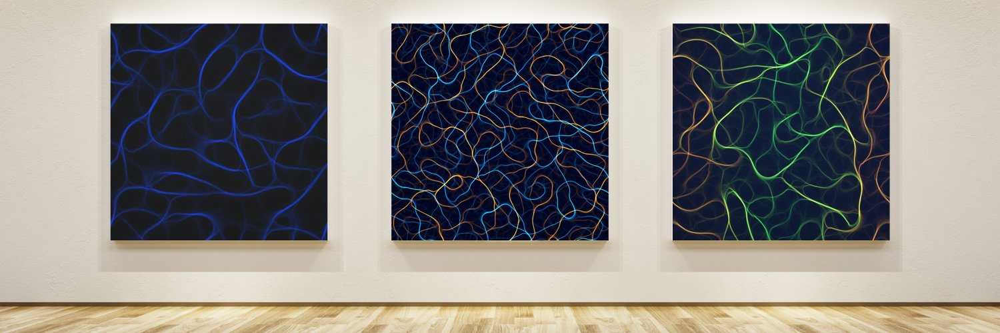

# Evolutions
Evolutions is an on-chain generative art project by [@emergentXY](https://twitter.com/emergentXY).

Artwork is generated via a p5.js script that meets the [ArtBlocks](https://docs.artblocks.io/) specifications. The art was sold as a digital collection in 2021 & the 529 unique pieces are stored on the [Solana](https://solana.com/) blockchain, along with all code to regenerate them. A detailed history of the project was published on [Substack](https://emergentart.substack.com/p/the-history-of-evolutions).

## Links
- Marketplace: [Magic Eden](https://magiceden.io/marketplace/flux)
- Artwork Explanation: ['A History of Evolutions' on Substack by @emergentXY](https://emergentart.substack.com/p/the-history-of-evolutions)

## Repo
This public repo contains the p5.js script & generator API. The p5.js script is also stored on-chain with [Arweave](https://www.arweave.org/) & linked to from the Solana token. The generator API is capable of generating any seed stored in a holder's Solana NFT contract, as well as generating novel artwork from other random seed choices.

## Generator API
### API URL Format
_/#/{hash}/{dumpImage(bool)}/{dumpVideo(bool)}/{windowSize(px)}/{canvasSize(px)}_

- **hash**: 256bit hash stored in the Solana NFT. e.g. [Evolutions #574](https://solscan.io/token/EncqDuY5s3zFhw1xsWqTxVjjTnx8zYwbR6ku9CWPa19G#metadata) -> [ArWeave JSON](https://pgehrcunm6g4czspizmncnsruf5xgap54gtbb7mzrmur3kcgh5ua.arweave.net/eYh4io1njcFmT0ZY0TZRoXtzAf3hphD9mYspHahGP2g/) -> 0xbab7eb7f77523f44c46adc448f8739d02fba865223800fac11d67d1561bc564f
- **dumpImage(bool)**: Output an image. True or False.
- **dumpVideo(bool)**: Output a video. True or False.
- **windowSize**: Size of the browser window in pixels. Only impacts rendering & therefore size of the output image or video generated.
- **canvasSize**: Size of the p5.js canvas in pixels. This is the scale at which the p5.js algorithm actually runs at. Larger = slower generation. Best to keep this in multiples of 1500px. The original outputs stored on-chain were generated at 4500px.

### Example - High Resolution 4500px image, no video

https://genemergent.github.io/evolutions/generator/#/0x70347520dd2e47cbf20c8996dc2783159cf412722bed78dbe471ae1544807d74/true/false/4500/4500

### Example - 720p video, no image

https://genemergent.github.io/evolutions/generator/#/0x70347520dd2e47cbf20c8996dc2783159cf412722bed78dbe471ae1544807d74/false/true/720/4500

